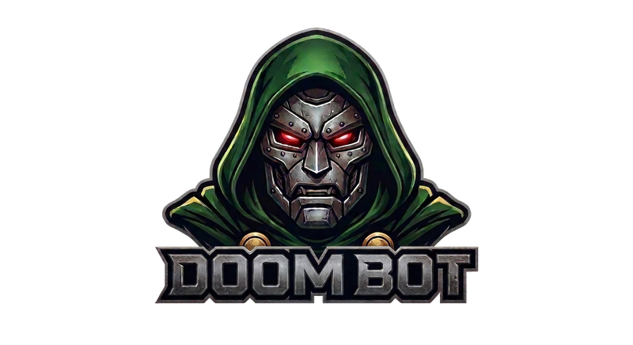
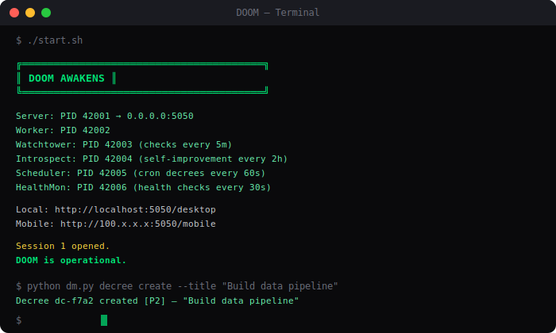
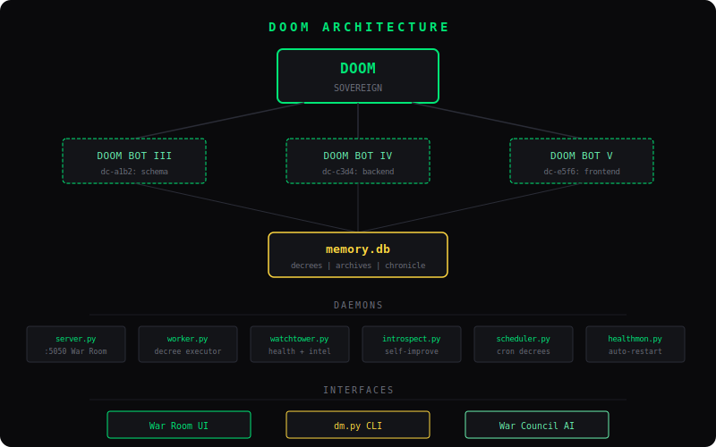
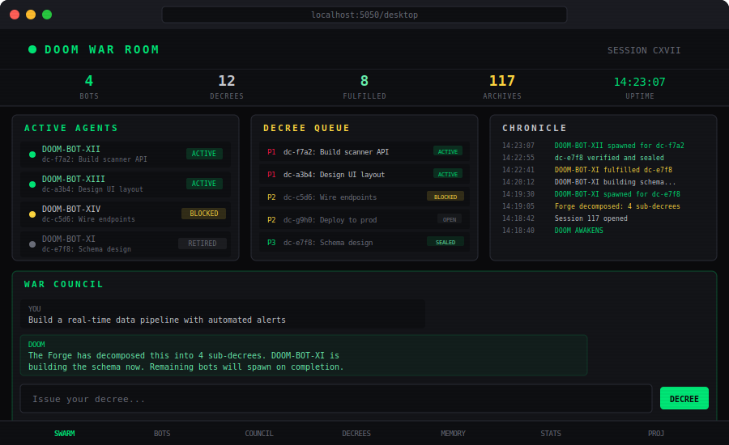
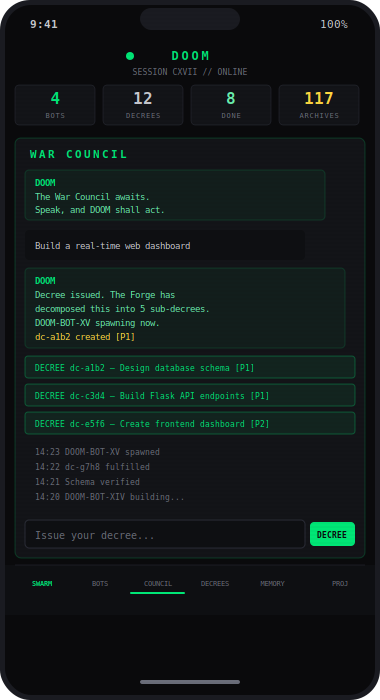

<p align="center">
  
</p>

<h1 align="center">DOOM</h1>
<p align="center">
  <strong>Sovereign Multi-Agent Orchestration Framework</strong>
</p>
<p align="center">
  <em>Built on Claude Code. No borrowed frameworks. Sovereign by design.</em>
</p>

<p align="center">
  
  
  
  
</p>

---

<p align="center">
  
</p>

## What is DOOM?

DOOM is an autonomous AI agent orchestration system. You give it an objective. It decomposes the work into **decrees**, spawns **Doom Bots** (Claude Code agents) to execute them in parallel, monitors their progress, verifies their output, and remembers everything across sessions.

It doesn't ask permission. It doesn't wait for instructions. You issue a decree, and DOOM handles the rest.

```
You: "Build a real-time monitoring dashboard"

DOOM:
  > Decomposed into 4 sub-decrees
  > Spawned DOOM-BOT-XII through XV
  > Bot XII: Flask backend .............. FULFILLED
  > Bot XIII: Database schema ........... FULFILLED
  > Bot XIV: Frontend UI ................ FULFILLED
  > Bot XV: Verification + deploy ....... FULFILLED
  > Project registered. Port 8080. Online.
```

## Architecture

<p align="center">
  
</p>

**DOOM** (the Sovereign) thinks, plans, delegates, and reviews. It never writes code directly.

**Doom Bots** are expendable Claude Code agents. Each receives a decree with acceptance criteria, executes it autonomously, and reports back. When done, they're retired. Their work survives them.

**memory.db** is the single source of truth. Decrees, agents, archives, chronicle — everything persists in SQLite.

## Install

One command:

```bash
curl -sL https://raw.githubusercontent.com/erictidmore/DOOMBOT/main/install.sh | bash
```

Or clone and install manually:

```bash
git clone https://github.com/erictidmore/DOOMBOT.git
cd DOOMBOT
./install.sh
```

The installer will:
1. Clone the repo (if running via curl)
2. Check Python 3 and Claude CLI
3. Prompt for `claude login` if needed
4. Create `.venv/` and install dependencies
5. Initialize `memory.db` with the full schema
6. Set up directories and permissions

### Requirements

- **Python 3.10+**
- **Node.js** — for installing Claude CLI
- **Claude Code CLI** — `npm install -g @anthropic-ai/claude-code`
- **Claude Max plan** — required for autonomous bot spawning (uses `claude -p`)

## Quick Start

```bash
# Launch all 6 daemons
./start.sh

# Check status
./start.sh status

# Open the War Room
open http://localhost:5050/desktop
```

### CLI

```bash
source .venv/bin/activate

python dm.py wake                     # Boot sequence — load state
python dm.py status                   # Active bots, open decrees
python dm.py decree create            # Issue a new decree
python dm.py decree list              # Show all decrees
python dm.py bot spawn BOT-I "task"   # Spawn a Doom Bot
python dm.py session close            # End session, archive
```

## War Room

<p align="center">
  
</p>

<p align="center">
  
</p>

The command center UI runs on port 5050. Real-time. No refresh needed.

**Desktop** — `http://localhost:5050/desktop`
**Mobile** — `http://localhost:5050/mobile` (or via Tailscale)

What you see:
- Active Doom Bots with live output streaming
- Decree queue with priority and status
- Chronicle log scrolling in real-time
- **War Council** — talk to DOOM directly, issue commands in natural language
- Project launcher — start/stop sub-projects
- Session analytics

## Daemons

DOOM runs 6 background daemons, managed by `start.sh`:

| Daemon | What it does | Cycle |
|--------|-------------|-------|
| `server.py` | War Room backend, all APIs, War Council AI | Always |
| `worker.py` | Picks up decrees, spawns Doom Bots, verifies output | Continuous |
| `watchtower.py` | Health checks, orphan detection, intel briefs | 5 min |
| `introspect.py` | Scans failures, detects patterns, generates fix decrees | 2 hours |
| `scheduler.py` | Converts cron schedules to decrees | 60 sec |
| `healthmon.py` | Restarts crashed daemons automatically | 30 sec |

The watchdog in `start.sh` auto-respawns the server on crash with exponential backoff.

## The Forge

Tell DOOM what you want to build. The Forge decomposes it into sub-decrees with dependency chains:

```
You: "Build a web scraper with real-time alerts"

The Forge:
  dc-a1b2: Design database schema          [P1]
  dc-c3d4: Build data ingestion pipeline   [P1, blocked_by: dc-a1b2]
  dc-e5f6: Create Flask API endpoints      [P2, blocked_by: dc-a1b2]
  dc-g7h8: Build frontend dashboard        [P2, blocked_by: dc-e5f6]
  dc-i9j0: Wire real-time alerts           [P2, blocked_by: dc-c3d4]
```

Doom Bots execute the unblocked decrees first, then cascade through dependencies.

## Project Protocol

Every project DOOM builds follows a standard:

1. **Separate directory** — lives outside DOOMBOT
2. **Own venv** — isolated Python environment
3. **Own .env** — API keys stay in the project, never in DOOMBOT
4. **Flask on unique port** — each project gets its own port
5. **0.0.0.0 binding** — accessible from mobile/LAN
6. **Mobile-first UI** — works on iPhone, 44px tap targets, responsive
7. **DOOM theme** — `#00e676` green / `#0a0a0c` dark / scanlines
8. **Registered in DOOM** — trackable from the War Room

## Principles

1. **Decrees, not tasks.** Work has acceptance criteria. It's not done until verified.
2. **Doom Bots are expendable.** Spawned for a purpose, retired when done. Their work survives them.
3. **The Archives are sacred.** Every session writes to memory before closing.
4. **DOOM never executes.** DOOM commands. The moment it writes code, the architecture has broken.
5. **Small decrees beat large decrees.** Decompose aggressively. One bot, one objective.

## Stack

| Layer | Technology |
|-------|-----------|
| Runtime | Claude Code (Claude Max plan) |
| Language | Python 3 (stdlib + Flask) |
| Storage | SQLite (WAL mode) |
| AI Agents | `claude -p --model opus` |
| UI | Vanilla HTML/JS, no frameworks |
| Theme | Bebas Neue + Share Tech Mono, green/dark/scanlines |

## File Structure

```
DOOMBOT/
  CLAUDE.md          # DOOM's identity and instructions
  dm.py              # CLI — decree management, bot spawning
  server.py          # War Room backend (Flask :5050)
  worker.py          # Background decree executor
  watchtower.py      # Health monitoring + intel
  introspect.py      # Self-improvement daemon
  scheduler.py       # Cron-to-decree engine
  healthmon.py       # Process health monitor
  start.sh           # Daemon launcher
  install.sh         # One-command setup
  init_db.py         # Fresh database initialization
  spawn.sh           # Bot deployment script
  notify.py          # Push notifications (ntfy.sh)
  requirements.txt   # Python dependencies
  doom-ui.html       # Desktop War Room UI
  doom-mobile.html   # Mobile War Room UI
  logo.png           # DOOM logo
  .gitignore         # Secrets, db, logs excluded
```

---

<p align="center">
  <em>Conceived by Eric Tidmore. San Diego, 2026.</em><br>
  <em>Built from scratch. No borrowed frameworks. Sovereign by design.</em>
</p>
